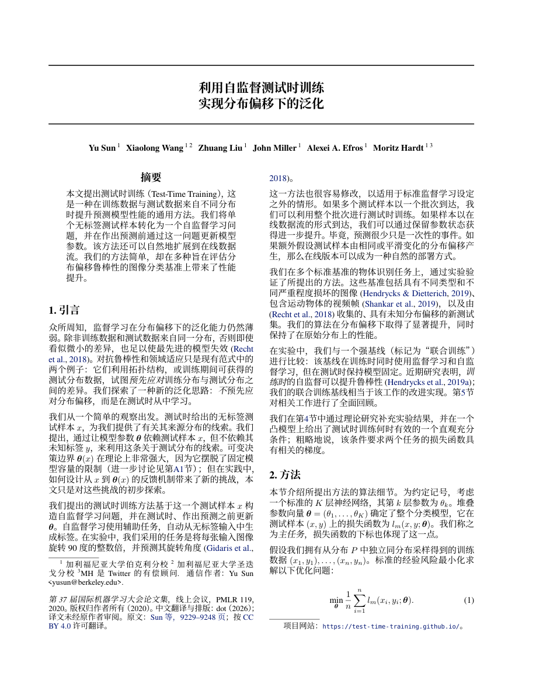
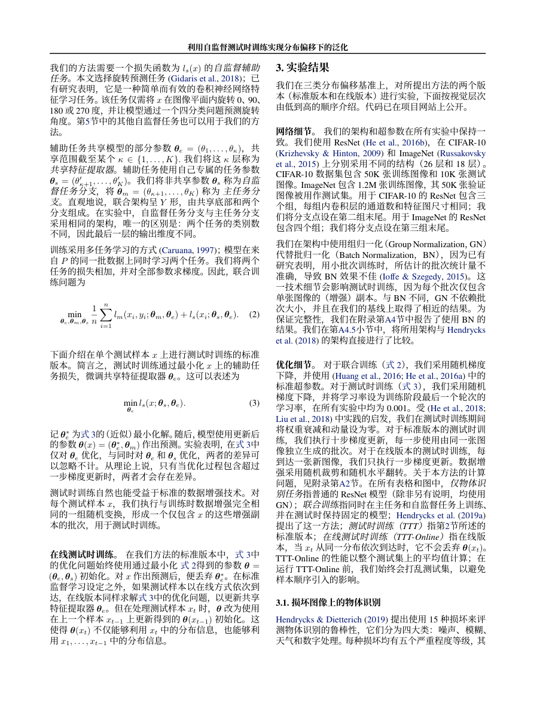
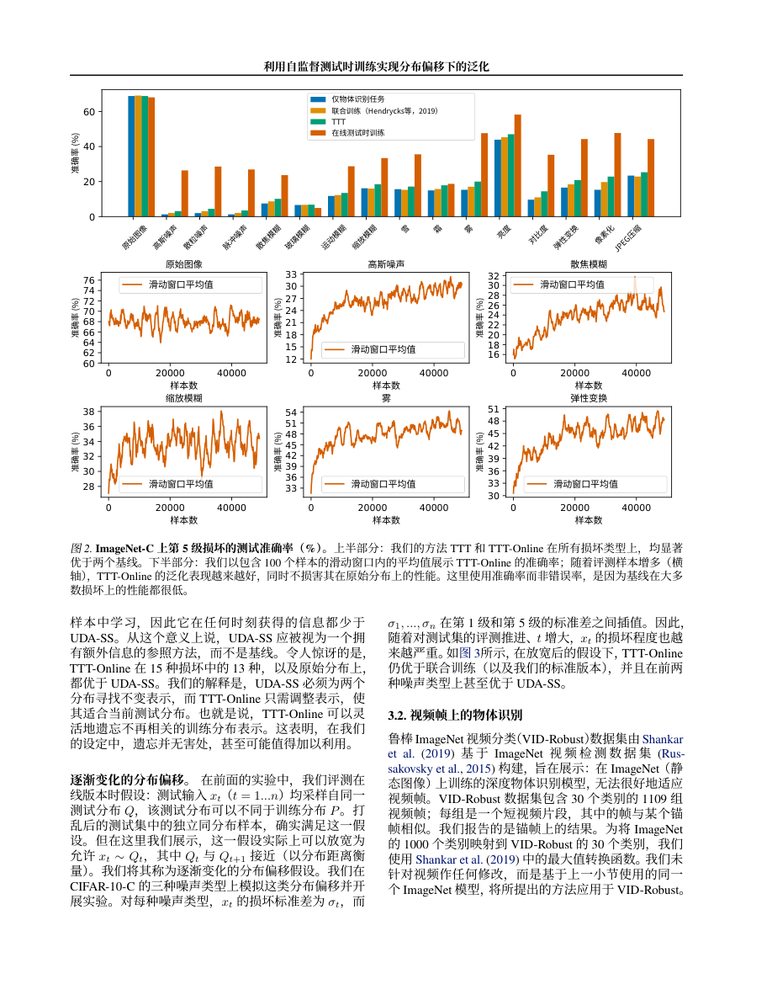

# Translate Paper ZH

**An Agent Skill for turning full academic papers into searchable Chinese PDFs while preserving their scholarly layout.**

[中文说明](README.md) · [SKILL.md](SKILL.md) · [Layout guide](references/layout.md) · [Audit schema](references/manifest.md)

Translate prose, captions, table headings, figure labels, footnotes and appendices. Prefer the paper's matching LaTeX source and actual conference or journal class. When only a PDF is available, the agent plans explicit text regions or reconstructs the layout, then inspects every output page.

## What it provides

- A source-led workflow for two-column papers, equations, figures, tables and citations.
- Traceable source-to-translation coverage, including labels invisible to ordinary extraction.
- Local helpers for inventory, planned PDF overlays, searchable-text/font/review auditing and conservative font subsetting.
- Explicit numeric, terminology, visual and semantic review requirements.

This is an agent-executed workflow. Translation and layout decisions require an agent with file and PDF tooling. The bundled scripts do not call a translation service. Page count may grow to accommodate readable Chinese text.

## Output example

An author-provided Chinese edition of the TTT paper (ICML 2020): 17 pages, approximately 4.4 MB. These are actual rendered PDF pages showing two-column text, equations and Chinese chart labels.

[Open the Chinese PDF](examples/ttt-2020/chinese.pdf) · [Source and attribution](examples/ttt-2020/README.md)







The publication review inspected these representative pages and checked text extraction across the file. This artifact was supplied by the author; the full translation was not rerun or independently reviewed for semantic fidelity during publication.

## Install

```bash
npx skills add vittta/translate-paper-zh --skill translate-paper-zh
```

Alternatively, download `translate-paper-zh.zip` from [Releases](https://github.com/vittta/translate-paper-zh/releases) and import it using your agent's skill installation mechanism.

Manual Codex installation, if the destination does not yet exist:

```bash
git clone https://github.com/vittta/translate-paper-zh.git ~/.codex/skills/translate-paper-zh
```

Refresh the skill list or reopen the agent after installation.

## Requirements

Python 3.10+ for the helpers:

```bash
python3 -m venv .venv
source .venv/bin/activate
python -m pip install -r requirements.txt
```

Composition also needs an embeddable Simplified Chinese font, such as Noto Sans CJK SC or Noto Serif CJK SC. The source-led route needs XeLaTeX or LuaLaTeX and the paper's template dependencies. Scans may require OCR. Fonts, TeX and OCR are not bundled.

The package uses standard `SKILL.md` structure and includes Codex interface metadata. Other Agent Skills-compatible environments can read the workflow but need suitable local file, PDF and composition tools. Cross-agent end-to-end compatibility has not been exhaustively tested.

## Example prompt

> Use $translate-paper-zh to translate this entire paper into Simplified Chinese as a searchable PDF. Preserve its two-column layout, equations, figures, tables, citations and appendices as closely as possible. Translate figure labels too. Inspect every output page for clipping, overlaps and legibility.

Provide matching LaTeX source when available. You can also specify a glossary, acronym policy or comparison pages.

Inputs: a paper PDF and any matching source assets. Outputs: a Chinese PDF, coverage manifests, review reports and rendered page previews in the working directory. Private manuscripts should be handled according to the agent's data settings and the user's authorization; the helpers themselves do not upload files.

## Helpers

| Script | Purpose |
| --- | --- |
| `paper_inventory.py` | Extract source blocks, record provenance/checksums, render pages |
| `overlay_regions.py` | Apply planned text regions while preserving artwork; reject detected region conflicts and overflow |
| `audit_translation.py` | Check coverage, searchable text, embedded Chinese fonts, English candidates and current-file review records |
| `optimize_pdf_fonts.py` | Save a smaller PDF only when page text and rendered pixels at the checking resolution remain identical |

See [manifest.md](references/manifest.md) for commands and schemas. Passing an audit verifies recorded gates; it does not establish semantic fidelity or prove that manual reviews happened.

## Validation and contributions

The release includes helper smoke checks for inventory generation and rejection of incomplete translation/review records. These check tool behavior, rather than serving as a real-paper translation benchmark.

Share reproducible layout issues or authorized examples through [Issues](https://github.com/vittta/translate-paper-zh/issues). Include the source version, agent/runtime, composition route and affected pages.

## Acknowledgements

Created from the author's academic-paper translation and layout workflow with agent assistance. The research process considered public projects including [academic-pdf-translation](https://github.com/ezra-y/academic-pdf-translation). The workflow and helper implementations are defined by the files in this repository.

Paper authorship, publication metadata and third-party material rights remain with their respective owners. Publishing this skill does not alter paper or font licenses.

## License

Skill instructions and helpers use the [MIT License](LICENSE). Paper examples and their translations are separately attributed under CC BY 4.0; the code license does not relicense paper content.
